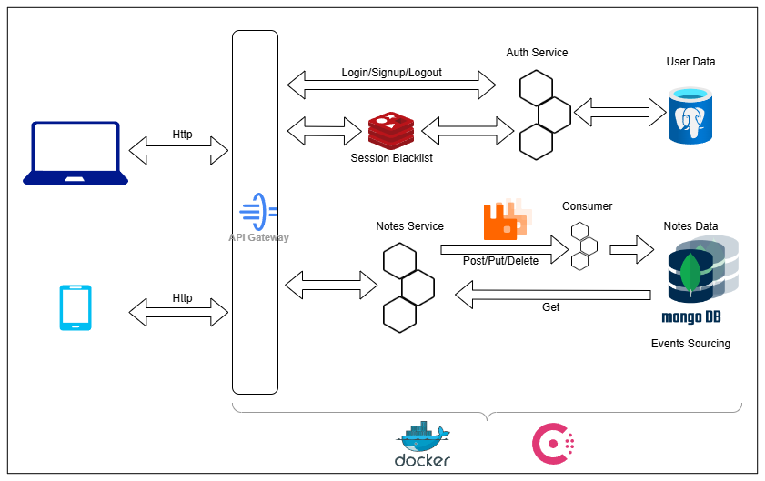

# Notes

## Usage
You need only docker compose to run this app

To start project:<br>
```run.sh```

To shutdown containers:<br>
```shutdown.sh```

## Result
You have access to few services

Main run runs at ```localhost:5000```

Rabbit MQ managament center available at ```localhost:5672```

Consul managament center available at ```localhost:8500```

## Extension
To extend microservices, use docker compose configuration file and /consul_loader/config.json

## Architecture



## Vision

The project is an opportunity to try out microservice architecture and apply it to something simple and familiar, opening up a new perspective. The program is a system that allows users to register, create, update, and delete notes. All actions are divided between services, which makes it possible to scale them as needed. Various tools have been tested, such as relational and non-relational databases, queues, and dictionaries. Security is ensured by using docker to isolate access to all services and using JWT tokens for the session.

## Use cases & product backlog

1. Registration and authentication

    Actors: User, Auth-service.

    The user registers, logs in, receives a JWT token (in HTTP-only cookies).

    Logout adds the token to the Redis blacklist.

2. Creating, editing, deleting notes

    Actors: User, Notes service

    CRUD operations on notes are stored in MongoDB.

    All changes are recorded as events for versioning purposes.

3. Viewing the history of changes to a note

    The user can see previous versions and changes.

Microservice architecture makes it easy to add new modules, for example, an analytical module for data analysis or a module for summarizing notes using artificial intelligence

## Additional
1. The system includes fault tolerance at the database and application levels
2. All changes to notes are marked as events. All actions related to the creation of actions go through an asynchronous queue, all actions related to receiving events from the database are requested directly from the database
3. Session token is stored in the Redis client, which acts as a blacklist in case of logout
4. JWT encoding uses a secret key that can be set in the .env file using the template “JWT_SECRET=<your_key>”
5. Consumer is not registered with Consul because it is not a RESTapi application
The web interface is made with standard Bootstrap tools
6. When calling microservices, a randomly marked Healthy is selected from the list